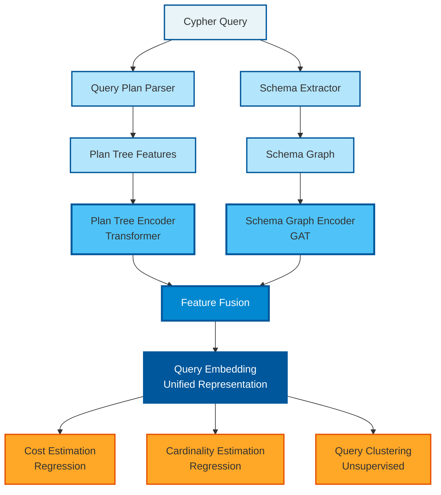
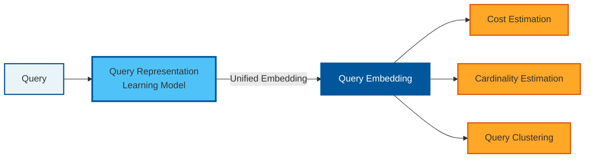
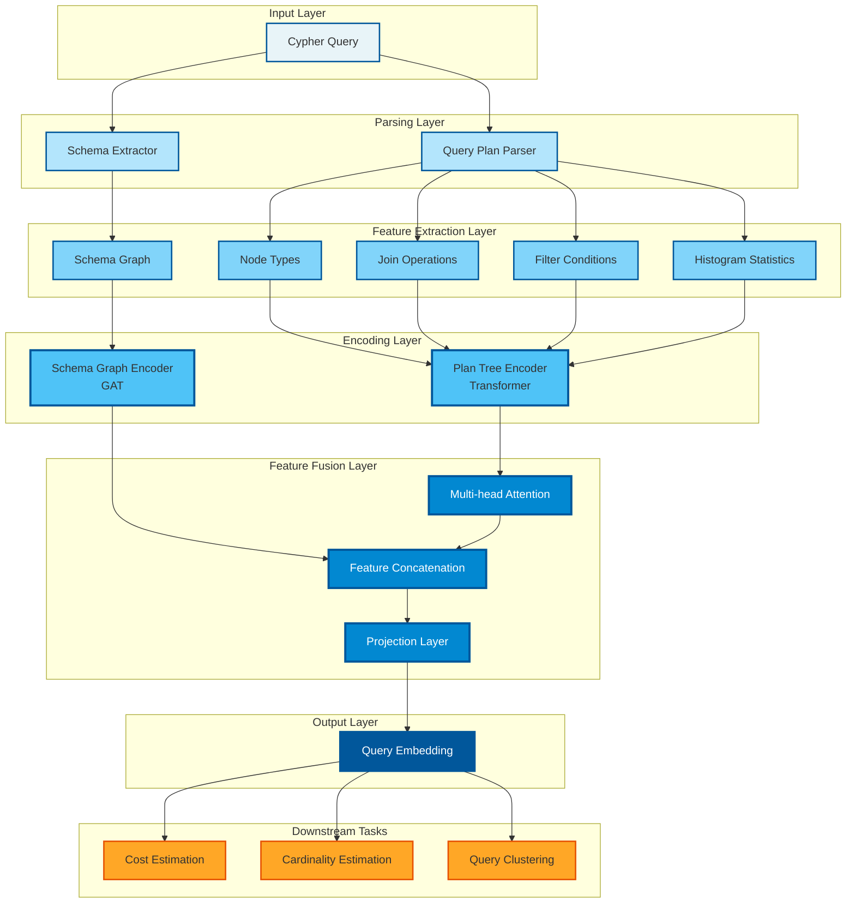

# 论文Pipeline图

## 查询表示学习模型架构

## 简化版本（适合论文正文）

## 详细架构图（适合技术章节）

## 使用说明

1. **完整版**：适合论文首页或架构章节，展示完整的模型流程
2. **简化版**：适合摘要或引言部分，突出核心思想
3. **详细版**：适合技术章节，展示各层细节

## 导出为图片

你可以使用以下工具将Mermaid图导出为图片：
- Mermaid Live Editor: https://mermaid.live/
- VS Code插件: Markdown Preview Mermaid Support
- 在线工具: https://github.com/mermaid-js/mermaid-cli

## 论文中的建议使用方式

1. **Figure 1**: 使用简化版展示整体框架
2. **Figure 2**: 使用完整版展示模型架构
3. **Figure 3**: 使用详细版展示技术细节
